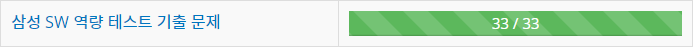

# SAMSUNG-CODING-TEST
	2020 삼성전자 하반기 SW역량 테스트 준비
	
* 슬슬 분류 귀찮은 관계로 하지 않음 (20.07.14)
* 백준 50문제 달성! (20.07.15)
* 백준 75문제 달성! (20.08.05)
* 역대 [삼성 코테 기출문제](https://www.acmicpc.net/workbook/view/1152) 완료 [33/33] (20.08.09)

* [삼성 모의 SW 역량 테스트](https://swexpertacademy.com/main/userpage/code/userProblemBoxDetail.do?probBoxId=AV5Po0AqAPwDFAUq&leftPage=1&curPage=userpage&userId=SWEAC) 푸는 중... [4/15]